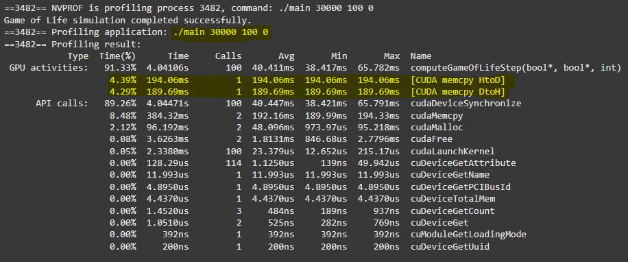
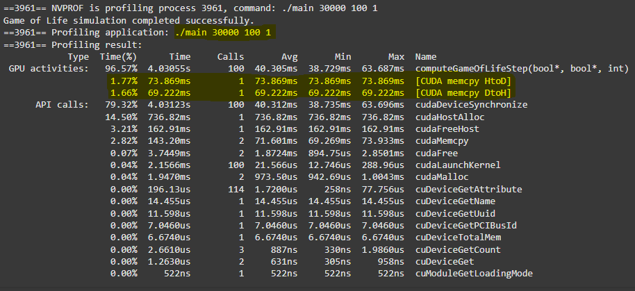

# cuda-gameoflife
GPU programming project. Implemented kernel that calculates next states of Game Of Life cellular automata with periodic conditions. Program allows the user to choose number of steps calculated and size of the state grid

Unpinned and pinned memory on the side of host were benchmarked against each other to show that copying memory from host to device and vice versa is faster with pinned (paged) memory.

|      Unpinned memory      |      Pinned memory      |
| :----------------------: | :-----------------------: |
|  |  |
